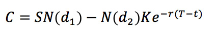
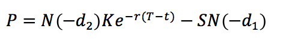
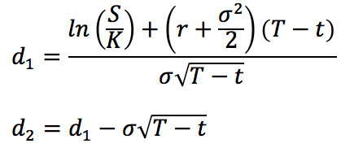

<h1 align="center">Black-Scholes Options Pricing Calculator</h1>

    
    
    

## Project Description

This project is a Black-Scholes Options Pricing Calculator for European Options including graphical visualization of the Option Greeks.
It is a web-hosted interactive application, hosted using [Streamlit's](streamlit.io) Sharing functionality.

The project can be found here: [Link to Project](https://tfsm00-black-scholes-calculator-bsm-streamlit-rm6hsi.streamlit.app/)

## Black-Scholes Model

The **Black-Scholes model**, also known as the **Black-Scholes-Merton (BSM) model**, the latter taking **dividends** into account, is one of the most important concepts in modern financial theory. This mathematical equation estimates the theoretical **value of options**, taking into account the impact of time and other risk factors.

The Black-Scholes equation requires **five variables**. These inputs are **volatility**, the **price of the underlying asset**, the **strike price** of the option, the **time until expiration** of the option, and the **risk-free interest rate**. With these variables, it is theoretically possible for options sellers to set rational prices for the options that they are selling.

## Black-Scholes Model Assumptions

The Black-Scholes model makes certain assumptions:

- No dividends are paid out during the life of the option.
- Markets are random (i.e., market movements cannot be predicted).
- There are no transaction costs in buying the option.
- The risk-free rate and volatility of the underlying asset are known and constant.
- The returns on the underlying asset are log-normally distributed.
- The option is European and can only be exercised at expiration.

## Call and Put Option Price Formulas

Call option (C) and put option (P) prices are calculated using the following formulas:

The formulas for d1 and d2 are:

## The Option Greeks

"The Greeks" measure the sensitivity of the value of an option to changes in parameter values while holding the other parameters fixed. They are partial derivatives of the price with respect to the parameter values.

The Greeks are important not only in the mathematical theory of finance, but also for those actively trading. Financial institutions will typically set (risk) limit values for each of the Greeks that their traders must not exceed. Delta is the most important Greek since this usually confers the largest risk.

Their formulas can be seen below:

## Sources

Black-Scholes Model Explanation: [Wikipedia](https://en.wikipedia.org/wiki/Black%E2%80%93Scholes_model) and [Investopedia](https://www.investopedia.com/terms/b/blackscholes.asp)

Formula Images: [Macroption](https://www.macroption.com/black-scholes-formula/)

## Issues and Suggestions

If you encounter an error in the program, a way to make code faster, any wrong application of financial formulas and concepts or just want to make a suggestion on how to make this project better raise a new issue [here](https://github.com/TFSM00/Black-Scholes-Calculator/issues/new/choose). 

## 📝 Licence

Copyright © 2022 [Tiago Moreira](https://github.com/TFSM00). 
This project is [MIT](https://github.com/TFSM00/Black-Scholes-Calculator/blob/main/LICENSE.txt) licensed.
